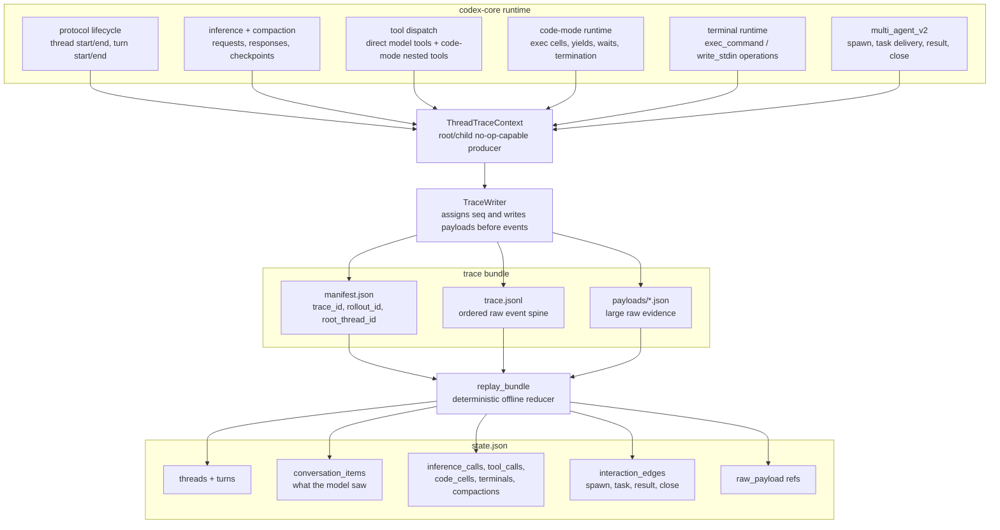
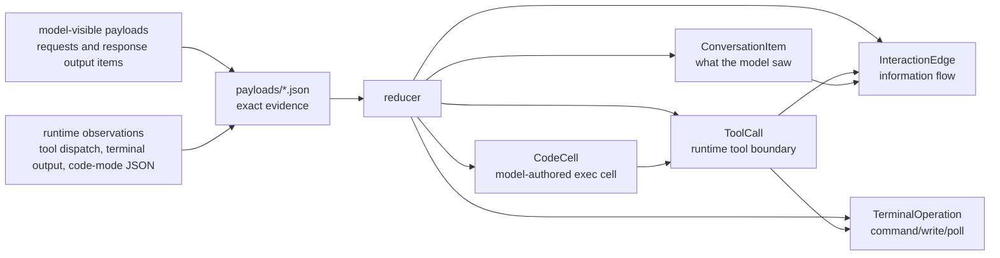
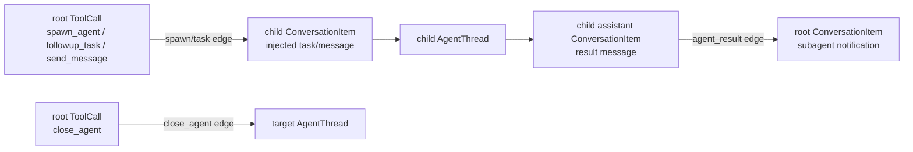

# Rollout Trace

> **Privacy:** Rollout tracing is not telemetry. Codex does **not** upload or
> report these traces; it writes local bundles only when
> `CODEX_ROLLOUT_TRACE_ROOT` is set. Those local bundles can contain prompts,
> responses, tool inputs/outputs, terminal output, and paths, so treat them as
> sensitive.

Rollout tracing is an opt-in diagnostic path for understanding what happened
during a Codex session. It records raw runtime evidence into a local bundle on
disk, then replays that bundle into a semantic graph that a debugger or UI can
inspect.

The key design choice is: **observe first, interpret later**.

Turn completion preserves the protocol's terminal error: an unsuccessful turn
is `failed`, while an orderly session shutdown can still be `completed`.
Intermediate recoverable errors do not end the turn. Every admitted tool
dispatch records one terminal outcome, including cancellation when its future
is dropped and failure when it unwinds from a panic. These dispatch outcomes
do not invent a process exit code or prove that an underlying child stopped;
terminal runtime events and process cleanup are separate evidence.

When provider-command authentication is selected, failed acquisition produces
no inference attempt or provider request. Existing explicit static/environment
token precedence is unchanged.
Credential-helper diagnostics retain the failure stage and process status
without forwarding command paths, stdout or stderr.

Hot-path Codex code does not try to build the final graph while the session is
running. It writes ordered raw events and payload references. The offline reducer
then decides which events became model-visible conversation, which events were
runtime work, and how information moved between threads, tools, code cells, and
terminal sessions.

## What This Gives Us

Rollout traces make failures debuggable when the normal transcript is not enough.
They preserve enough evidence to answer questions like:

- Which model request produced this tool call?
- Did this output come from the model-visible transcript, a code-mode runtime
  value, a terminal operation, or an agent notification?
- Which code-mode `exec` cell issued a nested tool call?
- Which terminal operation created or reused a running process?
- Which multi-agent v2 tool call spawned, messaged, received from, or closed a
  child thread?

The reduced `state.json` is intentionally not just a transcript. It is a graph of
model-visible conversation plus the runtime objects that explain how Codex got
there.

## System Shape



The thread context is deliberately small and no-op capable. A root session starts
one from `CODEX_ROLLOUT_TRACE_ROOT`; fresh spawned child threads derive their
own context from the parent's context so the whole rollout tree shares one
writer. Disabled contexts accept the same calls and record nothing.

Trace startup and writes are best-effort. Rollout tracing must never make a
Codex session fail just because diagnostic recording failed. Core emits raw
observations; this crate owns the bundle schema, trace-context APIs, writer, and
reducer.

### Storage and admission boundary

Each writer starts in a new or empty directory; it never reopens a previous
bundle or overwrites partial evidence. On Unix, directories are created with
mode `0700` and files with `0600`. Admission rejects linked or shared files and
unsafe directory ancestry; Linux also checks ownership against the current
process. These checks protect against other users, not malicious code running
as the same user. Windows ACL privacy still requires platform qualification.

Capture accepts at most 32 MiB for one complete serialized record, 256 MiB
across the manifest, event log and payloads, 65,536 events, and 4,096 payloads.
The per-record allowance accommodates large requests and tool outputs while the
aggregate and count limits bound diagnostic disk use and replay admission. It
is a storage policy, not a model context or output limit: no request is shortened
to make a trace fit. Oversize records reject whole before file creation; a write,
serialization or budget failure stops all further writes from that writer so
later events cannot conceal missing evidence. A partially written file can
remain after an I/O failure. There is no total quota across separate sessions,
automatic retention, credential redaction, or crash-durability promise here.

`admit_bundle` reads a bounded snapshot once and returns the existing reduced
graph alongside original manifest, event and referenced payload bytes. It checks
schema versions, contiguous event sequence, bundle identity, canonical payload
paths, consistent reference reuse and explicit inference terminal joins. Every
referenced payload is admitted as UTF-8 JSON, including protocol data the
projection ignores. Manifest and event bytes also require complete UTF-8; ignored
JSON fields cannot bypass that requirement.
`replay_bundle` uses this same boundary and returns only the diagnostic graph.

Successful admission is not proof of capture completeness or a provider outcome.
Partial captures remain useful; missing raw terminals remain missing even when
the graph infers closure from a turn ending. Core inference attempts may include
multiple lower-level HTTP sends. Request bytes can represent a logical request,
and responses contain completed output items rather than every streaming delta.
Use original admitted bytes and raw event identities for provenance, apply a
separate full-content privacy policy before export, and distinguish native
normalized usage from provider billing. The reduced conversation alone omits
top-level request instructions and tool definitions.

### Private evidence stream

`codex debug trace-evidence <trace-bundle>` writes a finite private stream to
stdout. It refuses a terminal; the caller is responsible for a private pipe or
file destination. Rust callers use `write_evidence(bundle_dir, output)` with a
`Write` sink. This command does not invoke a provider, open another session,
redact, upload, or create an output file. It calls `admit_bundle` once and never
reopens the manifest, event log or payloads after admission.

Wire format **codex_trace_evidence, schema_version 1** uses compact JSON
descriptor lines, each at most **1,024 bytes including its LF**. A data descriptor
is followed by exactly its declared number of bytes and one separate framing LF.
Embedded newlines, whitespace, Unicode and JSON escapes remain original bytes;
the stream is not NDJSON or a JSON-string encoding of the bodies.

The exact descriptor fields and order are:

| Order | Descriptor |
|---|---|
| First | `{"kind":"header","format":"codex_trace_evidence","schema_version":1,"source_bytes":N,"graph_bytes":G,"event_count":E,"payload_count":P,"data_records":D}` |
| Data 1 | `{"kind":"manifest","bytes":N}` followed by the complete original manifest |
| Data 2 | `{"kind":"events","bytes":N}` followed by the complete original JSONL event log |
| Next P records | `{"kind":"payload","ordinal":O,"bytes":N}` followed by one original referenced payload |
| Last data | `{"kind":"graph","bytes":G}` followed by the existing reduced graph as compact JSON plus its JSON LF |
| Last | `{"kind":"end","source_bytes":N,"graph_bytes":G,"event_count":E,"payload_count":P,"data_records":D}` |

`source_bytes` sums original manifest, log and unique referenced payload bytes;
unreferenced files are excluded. `graph_bytes` includes the graph JSON's own LF,
in addition to which the frame carries a separate LF. `data_records=P+3` excludes
header/footer. Payload ordinals are strictly increasing **numeric** values in
`1..=4096`, referring to already-admitted `raw_payload:O` / `payloads/O.json`.
Gaps are legal; an ordinal may exceed P. No large native identity is duplicated
into a descriptor. Original event sequence remains contiguous from one.

Manifest and each payload are at most 32 MiB; the log and combined source are at
most 256 MiB; E is at most 65,536 and P at most 4,096. The reduced graph is encoded
before the first header, under its own **256 MiB** bound, because reduction can
amplify source content. Thus the maximum stream size is derived, not estimated:
`2*256MiB + (4096+5)*1024 + (4096+3) = 541074435` bytes, covering source, graph,
every descriptor and every data-frame delimiter. Graph serialization failure
leaves stdout empty; an I/O failure can leave an incomplete prefix. Flush failure
can leave complete bytes while the writer still fails.

A consumer must match declared and observed counts, lengths, ordering and footer,
then require EOF **and successful writer/process completion** before accepting
the stream. The footer means projection completion, not complete capture or
provider success. Raw terminal events remain the outcome evidence. The graph is
the existing diagnostic projection for links and ownership; it contains duplicate
private bodies and must not be persisted unredacted. Native request/response
surface limitations and unknown served model/billed cost remain as described
above. A separate consumer must apply its privacy boundary before persistence
or export. Hashes and reader/build identity belong to that consumer's provenance,
not an invented provider identity in this wire format.

## Bundle Layout

A trace bundle contains:

- `manifest.json`: trace identity and bundle metadata.
- `trace.jsonl`: append-only raw events ordered by writer-assigned `seq`.
- `payloads/*.json`: raw requests, responses, tool inputs/results, runtime
  events, terminal output, compaction data, and protocol snapshots.
- `state.json`: optional reducer output written by `codex debug trace-reduce`.

`trace_id` identifies this diagnostic artifact. `rollout_id` identifies the
Codex rollout/session being observed. Keeping those separate lets us reason about
the stored trace without confusing it with the product-level session identity.

To reduce a bundle:

```bash
codex debug trace-reduce <trace-bundle>
```

By default this writes `<trace-bundle>/state.json`. Rust callers can also call
`codex_rollout_trace::replay_bundle` directly, or use `reduce_to_file` to publish
the complete JSON with the same output protections as the CLI. The output parent
must already be private. Publication writes a bounded private temporary file in
that directory, then atomically replaces the destination. Existing private state
can be regenerated; bundle inputs, links and special files cannot be overwritten.
Failure before rename preserves the previous output. Cleanup is attempted and
its failures are reported alongside the original error; a private temporary file
may remain if cleanup fails. Atomic visibility does not promise crash durability.

## Raw Evidence vs Reduced Graph



This distinction is the reason the model has both raw payload references and
semantic objects. A code-mode nested tool call, for example, has JSON input and
output at the JavaScript runtime boundary, but the model-visible transcript only
contains the surrounding `exec` custom tool call and its eventual output.

The reducer keeps those facts separate:

- `ConversationItem` records what appeared in model-facing requests/responses.
- `ToolCall`, `CodeCell`, `TerminalOperation`, `InferenceCall`, and
  `Compaction` record runtime/debug boundaries.
- `InteractionEdge` records information flow between objects, such as a
  `spawn_agent` tool call delivering a task into a child thread.
- `RawPayloadRef` points back to exact evidence when a viewer needs more detail
  than the reduced graph stores inline.

## Multi-Agent v2

Multi-agent v2 child threads share the root trace writer. That means one root
bundle reduces into one graph containing the parent thread, child threads, and
the edges between them.



Top-level independent threads still get independent bundles. Spawned child
threads are different: they are part of the same rollout tree, so they belong in
the same raw event log, payload directory, and reduced `state.json`.

## Reducer Invariants

The reducer is strict where the raw evidence should be self-consistent:

- raw events are replayed in `seq` order;
- payload files must exist before events refer to them;
- reduced object IDs are stable within one replay;
- runtime events may be queued until the model-visible source or delivery target
  has been observed;
- model-visible conversation is derived from model-facing payloads, not from
  runtime convenience output;
- runtime payloads are evidence, not proof that the model saw the same bytes.

Those invariants let the reduced graph stay small while preserving a path back
to the original evidence whenever a debugger needs to explain why an object or
edge exists.
